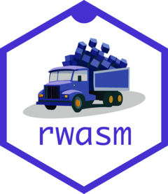

# rwasm <a href="https://r-wasm.github.io/rwasm/"></a>

<!-- badges: start -->
[](https://lifecycle.r-lib.org/articles/stages.html)
[](https://github.com/r-wasm/rwasm/actions/workflows/R-CMD-check.yaml)
<!-- badges: end -->

## Build R Packages for WebAssembly

This package provides functions to help build R packages compiled for WebAssembly (Wasm), manage Wasm binary R package libraries and repositories, and prepare webR compatible filesystem images for static web hosting of data files and R packages.

## Requirements

Building binary R packages for Wasm requires cross-compiling packages containing C/C++/Fortran source code using a Wasm development toolchain. As such, the [Emscripten](https://emscripten.org) C/C++ toolchain and a [version of LLVM `flang` configured to output Wasm](https://github.com/lionel-/f18-llvm-project/tree/fix-webr) must be available in the environment for the `rwasm` package to function.

For convenience, webR GitHub repository provides a [Docker container](https://github.com/r-wasm/webr/pkgs/container/webr) containing the full Wasm development environment required for building Wasm R packages.

## Installation
The `rwasm` package is not yet on CRAN. You can install the development version from GitHub via:

```r
# install.packages("pak")
pak::pak("r-wasm/rwasm")
```

Further information explaining how to set up the Wasm development environment and build R packages can be found in `vignette("rwasm")`.
