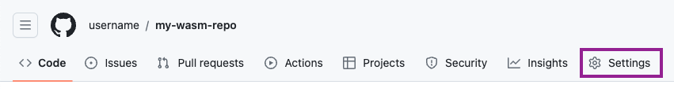

## Compiling R packages for WebAssembly

Building binary R packages for WebAssembly (Wasm) requires cross-compiling packages containing C/C++/Fortran source code using a Wasm development toolchain. As such, the [Emscripten](https://emscripten.org) C/C++ toolchain and a [version of LLVM `flang` configured to output Wasm](https://github.com/lionel-/f18-llvm-project/tree/fix-webr) must be available in the environment for the `rwasm` package to function.

There are two supported ways to ensure that the required environment and toolchain is available. Either install and build a local [development build of webR](https://github.com/r-wasm/webr), or use the `rwasm` package inside a pre-prepared Docker container to build Wasm R packages.

## Setting up the WebAssembly toolchain {.tabset}

### Using the webR Docker container

First, ensure that [Docker](https://www.docker.com) is installed on your machine^[For macOS machines with Apple Silicon processors, ensure that "Use Rosetta for x86/amd64 emulation on Apple Silicon" is disabled in the Docker Desktop settings.]. Then, in a terminal, pull the latest version of the [webR development container](https://github.com/r-wasm/webr/pkgs/container/webr):

```console
docker pull ghcr.io/r-wasm/webr:main
```

Next, create a new directory named `output` to store the built R packages,

```console
mkdir -p output
```

Then start R in the Docker container, mounting the new `output` directory into place and setting it as the working directory^[If you see an error along the lines of `The path [...]/output is not shared from the host and is not known to Docker`, follow the instructions given in the rest of the error output to ensure that the `output` directory is shared with Docker.]:

```console
docker run -it --rm -v ${PWD}/output:/output -w /output ghcr.io/r-wasm/webr:main R
```

You may now continue by working in this R session. The Docker container will provide the required development environment and tools for building binary R packages for Wasm. R packages and repositories built in this way will be written in the directory `output`.


### WebR development installation

Note that building webR from source takes a long time and a lot of disk space, mostly due to the requirement of building LLVM `flang` from source.

Follow [the webR build instructions](https://github.com/r-wasm/webr#building-webr-from-source) to download and build webR from source. If you are planning to build R packages that depend on system libraries, ensure that you also perform the optional step to additionally build all WebAssembly libraries.

Once webR has been built, we need to configure your environment so that the native R process can find your webR development installation. Make a note of your webR development directory and your Emscripten installation directory^[If you are using [emsdk](https://github.com/emscripten-core/emsdk) to manage your Emscripten installation the `EMSDK` environment variable should already be in place. In that case you may skip setting `EMSCRIPTEN_ROOT`.].

Edit or create the file `~/.webr-vars.mk`, and ensure it contains the following lines, replacing the values with your own installation directories:

```Makefile
WEBR_ROOT=/home/username/webr
EMSCRIPTEN_ROOT=/home/username/emsdk/upstream/emscripten
```

The settings above can also be made available to R by exporting them as environment variables.

## Installing the `rwasm` package

The `rwasm` package builds R binary packages for WebAssembly, organising the output into CRAN-like repositories. The [pak](https://pak.r-lib.org) package can be used to install `rwasm` from GitHub.

```{r}
#| eval: false
install.packages("pak")
pak::pak("r-wasm/rwasm")
```

Once installed, load the `rwasm` package. If `rwasm` is able to find the Wasm development environment, it will print the directories it discovered and the version of webR that it is targeting. This might be different to the version of R installed on your native system.

```{r}
#| eval: false
library(rwasm)
#> Targeting Wasm packages for R 4.3.0
#> With `WEBR_ROOT` directory: /opt/webr
#> With `EMSCRIPTEN_ROOT` directory: /opt/emsdk/upstream/emscripten
```

## Building an R package

R package binaries can be built for WebAssembly using the `build()` function. The resulting Wasm R package binary and an Emscripten filesystem image containing the R package are written to the directory given by the `out_dir` argument, defaulting to the current working directory.

```{r}
#| eval: false
build("cli")
```

Wasm R package binaries must be made available to the webR filesystem in some way before they can be used. Read on for more details on how to build an R package library for static web hosting of Wasm R packages. Alternatively, see `vignette("mount-fs-image.Rmd")` for details on how to mount Emscripten filesystem images.

## Adding an R package to a package repository

Use `add_pkg()` to build an R package (along with its dependencies) for Wasm and add it to an R package repository. A new directory named `repo` will be created for the repository if it does not already exist, otherwise the existing repository will be updated to include the new package. By default, hard package dependencies will also be built for Wasm and added to the repository.

```{r}
#| eval: false
add_pkg("cli")
```
 
See the `?pkgdepends::pkg_refs` article to see which kind of package references can be used to add packages to the repository.

## Managing and using the repository

The CRAN-like R package repository in the output directory `repo` should be hosted by a web server so that it is available at some URL. Such a URL can then be passed to `webr::install()` as a repository from which to install Wasm R packages.

### Local testing

The R command given below starts a local web server to serve your package repository for testing^[Ensure that the latest version of the `httpuv` package is installed so that the `?httpuv::runStaticServer` function is available.]. The `Access-Control-Allow-Origin: *` HTTP header is included, required for loading R packages from a cross-origin server through the [CORS](https://developer.mozilla.org/en-US/docs/Web/HTTP/CORS) mechanism.

If you are using a Docker container to build Wasm R packages, be sure to run the following command in a new R session outside Docker so that the web server is accessible to the host machine. You might also want to set `dir = "./output"` to serve the contents of the `output` directory mounted in the Docker container.

```r
httpuv::runStaticServer(
  dir = ".",
  port = 9090,
  browse = FALSE,
  headers = list("Access-Control-Allow-Origin" =  "*")
)
```

Once the web server is running start a webR session in your browser, such as the console at <https://webr.r-wasm.org/latest/>. Install a package from your local repository using your test server URL as the `repos` argument^[You might need to adjust the path portion of the URL, depending on your set-up. If it does not work, you could also try `"http://127.0.0.1:9090"` or `"http://127.0.0.1:9090/output/repo"`]:


```{r}
#| eval: false
webr::install("cli", repos = "http://127.0.0.1:9090/repo")
#> Downloading webR package: cli
```

### Deployment to static hosting

Once you are happy that your R package repository is working and sufficient, it should be deployed to the web via a static file hosting service of your choice. In this example we will use GitHub Pages.

First, create a new directory for your GitHub repository and copy your webR binary repo into place.

```
mkdir -p my-wasm-repo
cp -r ./path/to/output/repo my-wasm-repo/repo
cd my-wasm-repo
```

Next, initialise a new GitHub repository to host your binary R packages, and run the commands given by GitHub to initialise and push an initial commit of your Wasm binary packages.

```
git init
git add repo
git commit -m "First commit"
git branch -M main
git remote add origin https://github.com/username/my-wasm-repo.git
git push -u origin main
```

Now, in your web browser, refresh your GitHub project and click **Settings**. If you cannot see the "Settings" tab, click the dropdown menu, then click **Settings**.

```{r}
#| echo: false
#| out.width: 100%
#| fig.alt: "Screenshot of the GitHub repository heading bar, with the Settings link highlighted."

```

In the "Code and automation" section of the sidebar, click **Pages**.

Under "Build and deployment", under "Source", select **Deploy from a branch**.

Under "Branch", use the branch dropdown menu and select **main** as the publishing source, then click **Save**.

```{r}
#| echo: false
#| out.width: 100%
#| fig.alt: "Screenshot of the GitHub settings page for a repository. Under Code and automation, the Pages link is highlighted. Under Build and deployment, the Deploy from a branch setting is selected for the Source setting and highlighted. Under branch, main is selected as the publishing source and highlighted."
knitr::include_graphics("images/deploy.png")
```

GitHub will then start to prepare your GitHub Pages site to contain your CRAN-like Wasm package repository.

After a little while^[You should be able to see progress of the website build step in the **Actions** section of your GitHub project.], your GitHub Pages website will be ready and webR should be able to install your package from the GitHub Pages repo URL.

```{r}
#| eval: false
webr::install("cli", repos = "http://username.github.io/my-wasm-repo/repo")
#> Downloading webR package: cli
```
